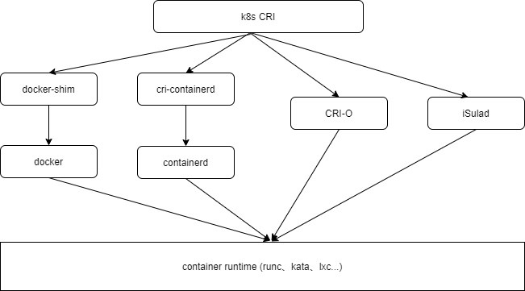
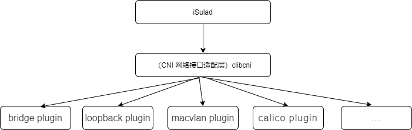
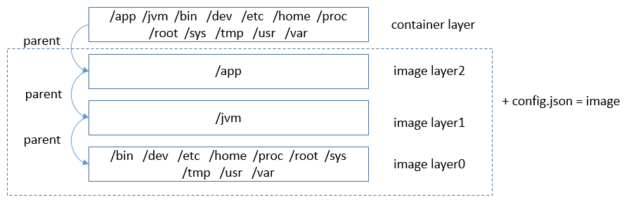
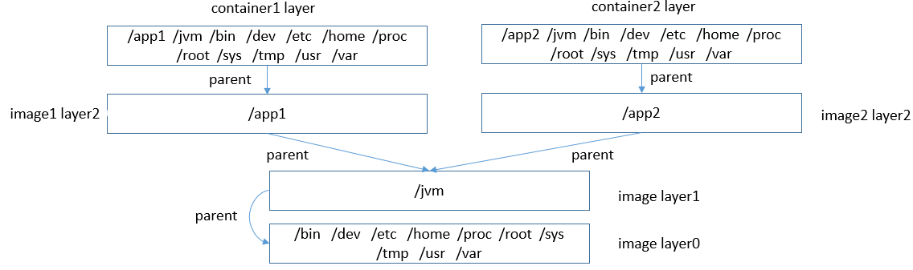

# iSulad 轻量级容器引擎架构解析

​	iSulad 是一种由 C/C++编程语言编写的容器引擎，当前已经在 openeuler 社区开源(https://gitee.com/openeuler/iSulad)。当前主流的容器引擎 docker、containerd、cri-o 等均是由 GO 语言编写。随着边缘计算、物联网等嵌入式设备场景的不断兴起，在资源受限环境下，业务容器化的需求越来越强烈。由高级语言编写的容器引擎在底燥占用上的劣势越来越凸显。另外由于容器引擎对外接口的标准化，因此用 C/C++重写一个容器引擎成为了可能。

​	

​	本文介绍 iSulad 的功能特性以及对整体架构进行介绍。

## iSulad有哪些功能特性

### 支持 CRI 标准协议

CRI(Container Runtime Interface)是由 K8S 定义的容器引擎需要向 k8S 对外提供的容器和镜像的服务的接口,供容器引擎接入 K8S。CRI 接口基于 gRPC 实现。iSulad 遵循 CRI 接口规范，实现 CRI gRPC Server，包括 Runtime Service 和 Image Service 分别用来提供容器运行时接口和镜像操作接口。iSulad 的 gRPC Server 需要监听本地的 Unix socket，而 K8S 的组件 kubelet 则作为 gRPC Client 运行。

### 支持 CNI 网络标准协议

CNI(Container Network Interface) 是 google 和 CoreOS 主导制定的容器网络标准协议。通过CNI协议，iSulad通过 JSON 格式的文件与具体网络插件进行通信，进而实现容器的网络功能。容器网络具体的功能均由网络插件来实现。iSulad 中使用C语言实现了clibcni接口模块，用来实现对应功能。

### 遵循OCI标准

OCI包含两个标准规范 **容器运行时标准 （runtime spec）和 容器镜像标准（image spec）**。

#### 支持OCI 标准镜像格式

iSulad支持OCI标准镜像格式以及与docker兼容的镜像格式。iSulad支持从docker hub等镜像仓库下载容器镜像，或者导入由docker 导出的镜像文件。

容器运行所需的rootfs以及一些资源配置等信息被打包成特定的数据结构，称为容器镜像。基于容器镜像可以方便地运行容器。由于运行环境和应用被一起打包到了容器镜像中，这样就解决了应用部署时的环境依赖问题。每个容器镜像由一个或多个层数据、以及一个config.json配置文件组成。多个层之间有依赖关系，这种依赖关系称为父子关系（被依赖的层为父层）。运行容器之前，所有层的数据会合并挂载成一个rootfs供容器使用，称为容器层。合并后的数据如果有冲突，则子层的数据会覆盖父层中路径名称都相同的数据。

​                                                                         图 单镜像的结构

镜像的分层是为了解决空间占用问题。如果本层及其所有递归依赖的父层具有相同的数据，这些数据就可以复用，以减少空间占用。下图描述的是具有相同layer0层和layer1层的两个容器镜像的数据复用结构：

​                                                                           图9-2 镜像层复用

#### 支持OCI 标准runtime

iSulad支持标准OCI runtime操作接口，可以进行容器生命周期管理。iSulad不仅支持当前主流的容器runtime 如runc、kata，而且针对低底噪的需求，将C语言编写的lxc进行了适配修改，使其能够作为支持OCI 标准协议的C语言runtime，进一步降低了容器引擎基础设施底噪开销。

##### 1) 运行容器

​    运行容器指创建一个新的容器，并启动该容器，即使用指定的容器镜像创建容器读写层，并且为运行指定的命令做好准备。创建完成后，使用指定的命令启动该容器。

$ isula create -it busybox

9c2c13b6c35f132f49fb7ffad24f9e673a07b7fe9918f97c0591f0d7014c713b

$ isula start 9c2c13b6c35f[[z1\]](#_msocom_1) 

​    也可以通过isula run命令直接运行一个新的容器。

$ isula run -itd busybox

133a65418cd7d95ae83ba611cae1b1c198de34a142e0b05dfbdeda01c2867d50

##### 2) 暂停/恢复容器

暂停容器指通过freezer cgroup挂起指定容器中的所有进程，恢复容器为暂停容器的逆过程，用于恢复被暂停容器中所有进程。

$ isula pause 9c2c13b6c35f

9c2c13b6c35f132f49fb7ffad24f9e673a07b7fe9918f97c0591f0d7014c713b

$ isula unpause 9c2c13b6c35f

9c2c13b6c35f132f49fb7ffad24f9e673a07b7fe9918f97c0591f0d7014c713b

##### 3) 销毁容器

销毁容器指停止并删除容器。首先向容器中的首进程发送SIGTERM信号以通知容器退出，如果在指定时间（默认为10s）内容器未停止，则再发送SIGKILL信号时主动杀死容器进程。无论容器以何种方式退出，最后都会回收和删除该容器所占用资源。

$ isula stop 9c2c13b6c35f

9c2c13b6c35f132f49fb7ffad24f9e673a07b7fe9918f97c0591f0d7014c713b

$ isula rm 9c2c13b6c35f

9c2c13b6c35f132f49fb7ffad24f9e673a07b7fe9918f97c0591f0d7014c713b

也可以通过更简洁的方式强制销毁容器。

$ isula rm –f 133a65418cd7

133a65418cd7d95ae83ba611cae1b1c198de34a142e0b05dfbdeda01c2867d50