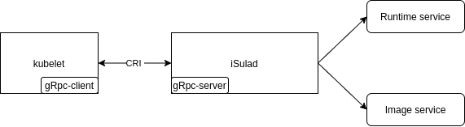

# iSulad 轻量级容器引擎架构解析

iSulad 是一种由 C/C++编程语言编写的容器引擎，当前已经在 openeuler 社区开源(https://gitee.com/openeuler/iSulad)。当前主流的容器引擎 docker、containerd、cri-o 等均是由 GO 语言编写。随着边缘计算、物联网等嵌入式设备场景的不断兴起，在资源受限环境下，业务容器化的需求越来越强烈。由高级语言编写的容器引擎在底燥占用上的劣势越来越凸显。另外由于容器引擎对外接口的标准化，因此用 C/C++重写一个容器引擎成为了可能。
本文介绍 iSulad 的功能特性以及对整体架构进行介绍。

## 功能特性

1.  支持 CRI 标准接口

    CRI(Container Runtime Interface)是由 K8S 定义的容器引擎需要向 k8S 对外提供的容器和镜像的服务的接口,供容器引擎接入 K8S。CRI 接口基于 gRPC 实现。iSulad 遵循 CRI 接口规范，实现 CRI gRPC Server，包括 Runtime Service 和 Image Service 分别用来提供容器运行时接口和镜像操作接口。iSulad 的 gRPC Server 需要监听本地的 Unix socket，而 K8S 的组件 kubelet 则作为 gRPC Client 运行。
    

2.  支持 CNI 网络标准

    CNI(Container Network Interface) 是 google 和 CoreOS 主导制定的容器网络标准协议。这个协议连接了两个组件：容器管理系统和网络插件。它们之间通过 JSON 格式的文件进行通信，实现容器的网络功能。具体的事情都是插件来实现的，包括：创建容器网络空间（network namespace）、把网络接口（interface）放到对应的网络空间、给网络接口分配 IP 等等。
